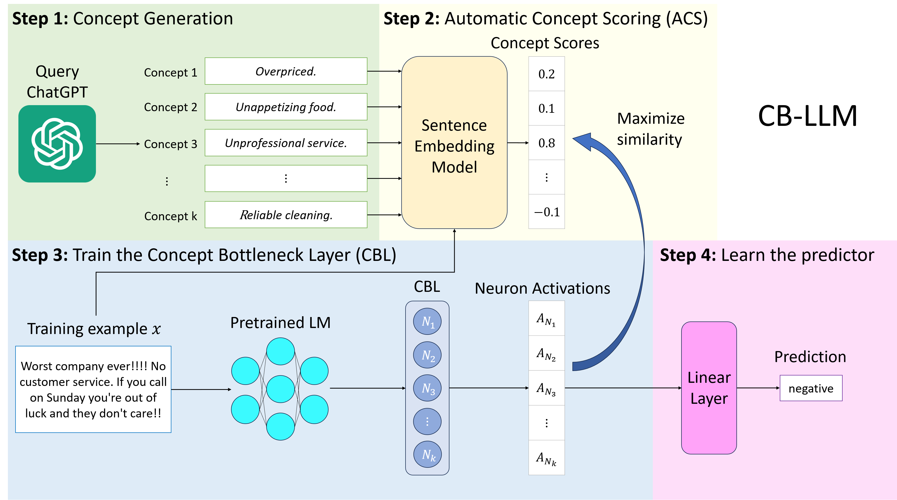

# ConceptBottleneck-GUI-Experiment

This project builds on Weng et al. (2024) *Crafting Large Language Models for Enhanced Interpretability* by developing a user-friendly GUI for integrating Concept Bottleneck Layers (CBLs) into Large Language Models (LLMs). Weng's Concept Bottleneck Large Language Model (CB-LLM) combines high accuracy, scalability, and interpretability, setting a new standard for transparent AI.  
Our GUI simplifies the process, enabling users of all skill levels to visualize concept activations, adjust weights, and unlearn biases, promoting interpretability, fairness, and trustworthiness.



---

## Project Structure

- **`src/`**: Core source code for the project, including:
  - **`app.js`**: Core React frontend code responsible for handling user interactions and making API calls to the backend repo.
  - **`index.js`**: Entry point for executing `app.js` in the React frontend.
- **`public/`**: Static assets for the GUI frontend, managed by React.
- **`package.json`**: Defines Node.js dependencies for the React frontend.

---

## How to Run the Project

### 1. Set Up the Environment
Create and activate a virtual environment:
```bash
python -m venv cbm_env  # Create virtual environment
source cbm_env/bin/activate  # Activate it on macOS/Linux
cbm_env\Scripts\activate  # Activate it on Windows
```

### 2. Frontend Setup
Install Node.js dependencies:
```bash
npm install
```

### 3. Running the Project
Start the Frontend. From the root folder, run:
```bash
PORT=3050 npm start
```
This will start the React frontend server on port 3050.

### 4. Communication
The frontend communicates with the backend at `http://localhost:5050`. Ensure both are running for full functionality.
Access the backend repo through this link: [CBM-GUI-Backend](https://github.com/sxluong/CBM-GUI-Backend)

---

# Project Goal
Now that we have a basic foundation of CBL, our project aims to develop a user-friendly GUI that automates much of the technical complexity involved in integrating and interacting with CBLs in LLMs. Weng et al. (2024) developed an automated pipeline to integrate CBLs into LLMs, but it requires users to run technical scripts.
The GUI is designed with five main interfaces that guide the user through the process of integrating a CBL into an LLM, from dataset selection to model experimentation and history tracking.


# Application Architecture and Features
We have moved beyond the Minimal Viable Product (MVP) stage and developed a full application with microservices, database storage, and a structured backend-frontend system. The application features a Django backend, React frontend, and SQLite3 database for model storage.
The CBM-GUI is designed to provide users with an intuitive and interactive experience for training, visualizing, and refining Concept Bottleneck Layers in LLMs. Users can:
- Train multiple models in separate tabs with different configurations.
- View real-time progress of training and see concept activation visualizations.
- Analyze the top contributing concepts for each model decision.
- Save trained models to the SQLite3 database for future use and comparisons.
The GUI simplifies the process of integrating CBLs into LLMs by providing clear workflows and real-time visual feedback, making advanced interpretability tools accessible to both researchers and practitioners.
